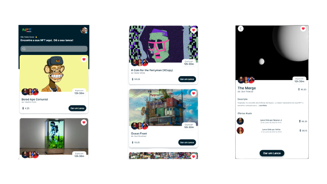

    
    <h1>
        Fabio Cezar
    </h1>
    <h3>Jovem apaixonado por programação e tecnologias.</h3>
    
A NFT Prime é um aplicativo mobile para android e ios de leilões NFT onde vários criadores podem leiloar suas obras digitais a um lance mínimo que ache justo. É estabelecido um tempo de duração da oferta do Leilão para que seja feito os lances. Desenvolvi usando as seguintes tecnologias: React Native, Expo e Node.js e como usar o Expo CLI para implantar e publicar meu aplicativo.

